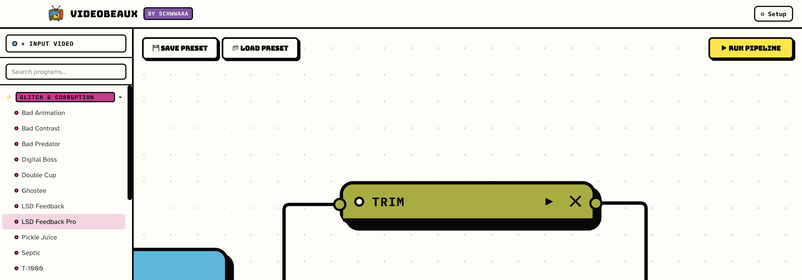
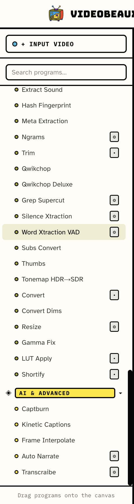
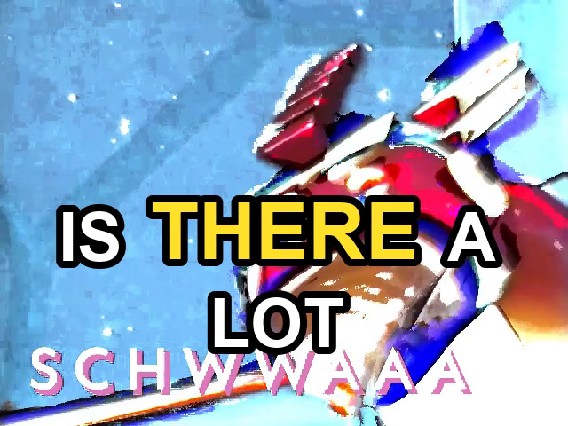

<p align="center">
  
</p>

<p align="center"><em>The friendly multilateral video toolkit built for artists by artists. It's your best friend.</em></p>

<p align="center">
  <strong>148 effect/utility programs</strong> · node-based GUI + scriptable CLI · <strong>100% local</strong> — no cloud, no accounts, no API keys
</p>

---

Videobeaux is a video-processing toolkit built around one big library of effects — glitch/corruption looks, temporal/frame effects, colour and visual filters, compositing tools, transcript-driven editing, and AI-assisted captioning/narration — and two ways to drive it:

- **The GUI**: drag effect nodes onto a canvas, wire them together into a pipeline, hit Run.
- **The CLI**: `python3 -m videobeaux.cli -P <program> -i input.mp4 -o output.mp4 [options]`, script it however you want.

Both sit on the exact same 148 programs — nothing is GUI-exclusive or CLI-exclusive except a couple of legacy modes noted below. Everything runs on your machine. The one genuinely optional exception — AI narration scripting via a local [Ollama](https://ollama.com) model — is opt-in and the app works completely fine without it.

<p align="center">
  
</p>

## Contents

- [The GUI](#the-gui)
  - [For users — just want to run it?](#for-users--just-want-to-run-it)
  - [What you get](#what-you-get)
  - [Optional AI features](#optional-ai-features)
- [The CLI](#the-cli)
  - [Basic usage](#basic-usage)
  - [Examples](#examples)
- [Installing from source](#installing-from-source)
- [Building GUI installers](#building-gui-installers)
- [Programs](#programs)

## The GUI

A visual, node-based editor for building video pipelines out of videobeaux's effects. Input node → chain of effect nodes → Output node, connected however you like — branch, fan-out, batch-process a whole folder. No cloud services, no accounts, no telemetry.

<p align="center">
  
  &nbsp;&nbsp;
  
</p>

*Left: the effect library, organized by category — drag anything onto the canvas. Right: a frame from Kinetic Captions, one of the AI & Advanced programs — the actively-spoken word pops larger in real time, rendered locally with no ML model.*

### For users — just want to run it?

Download the installer for your platform from the [Releases](../../releases) page:

- **macOS**: download the `.dmg`, open it, drag videobeaux into Applications.
- **Windows**: download the `.exe` and run it.

No Python, Node, or ffmpeg install needed — everything the app needs to run is bundled inside.

On first launch, a **Setup** screen walks you through getting fully working:
- Confirms the bundled Python and ffmpeg are working correctly.
- Lets you download a speech-recognition model (needed for transcript-driven effects — Silence Xtraction, Word Xtraction, Grep Supercut, Ngrams, Qwikchop Deluxe, Auto Narrate) — pick small/fast or large/accurate, right from the app.

Reopen this screen anytime from the **⚙ Setup** button in the header — it's not a one-time wizard.

**A couple of things to expect on an unsigned build:**
- **macOS**: Gatekeeper will say the app "can't be opened because it is from an unidentified developer." Right-click (or Control-click) the app and choose **Open**, then confirm — you only need to do this once. Proper code signing/notarization is a planned follow-up, not yet in place.
- **Windows**: SmartScreen may show a similar "Windows protected your PC" warning. Click **More info → Run anyway**.

### What you get

- **A node canvas** — drag any of the 148 programs onto it, wire Input → effects → Output. Multiple effects chain into one pipeline; branch one output into several downstream effects.
- **Batch mode** — point an Input node at a folder instead of a file and the whole pipeline runs once per video. Programs that natively produce many files from one input (Qwikchop, Qwikchop Deluxe, Extract Frames) fan out automatically.
- **Save/load presets** — snapshot the whole node graph (including every field you've filled in) to a `.vbpreset.json` file and reload it later.
- **Live model pickers** — Vosk (speech-to-text), Ollama (local LLM), and kokoro-tts voice dropdowns are all populated by asking the actual installed tool what it has, not a hardcoded list — install a new model and it just shows up.
- **A real-time colour picker** on every colour field (captions, LUTs, watermarks) — a native OS colour wheel, synced with a plain hex field you can also just paste into.

### Canvas tips

- **Connect with two clicks** — click a dot, a line follows your cursor, click another dot. (Dragging still works; Esc or a click on empty space cancels.)
- **Select several** — ⌘/Ctrl-click, Shift-drag a box, or ⌘A; selected programs get a bold yellow ring and a banner with a Delete button. Backspace/Delete removes them all (undo with ⌘Z).
- **Groups** — select two or more programs and press ⌘G (or *Group*): they move together, can be locked, renamed and colored, and a caret folds the whole group into one compact card (⇧⌘G ungroups). Folding is only visual — connections and what runs are unchanged.
- **Copy / paste** — select programs, ⌘C, then ⌘V pastes them (with the connections between them) at your cursor; ⌘D duplicates in place. The small bar at the bottom-left has the same buttons and can be switched off under 🎨 Appearance.
- **Number fields** — type a value or use the arrow keys; anything with a known range also gets a slider, and typed values are clamped to the range.
- **Layout editor (Lagkage)** — press ✎ next to *Layout JSON* to drag images, GIFs and videos onto a stand-in for your video instead of writing JSON. Positions are saved as percentages, so a layout works at any resolution. The same ✎ button mechanism (`components/helpers/registry.js`) can host editors for other programs.
- **Transparent keying** — Chroma Key / Luma Key with *Background = transparent* needs the Output node set to **WEBM** or **MOV**.

### Add your own photobooth filters

Drop a `.py` file into `~/.videobeaux/filters/` (or the folder in `VIDEOBEAUX_USER_FILTERS`) and restart:

```python
from videobeaux.utils.booth_filters import register

@register("My filters", "Invert red")      # shows up in Filter Library → Filter as "My filters · Invert red"
def invert_red(img, ctx):                  # img: BGR uint8 frame; ctx.t = seconds, ctx.faces = [(x, y, w, h)]
    out = img.copy()
    out[..., 2] = 255 - out[..., 2]
    return out
```

### Optional AI features

Entirely opt-in, never required for the app to work:
- **Auto Narrate**'s AI-scripted narration path needs a local [Ollama](https://ollama.com) server with a model pulled (`ollama pull llama3.1:8b` or similar; the Setup screen shows whether it's running and links to the download) — or skip it and just type/paste your own narration text, which needs no extra setup at all.
- **Auto Narrate**'s text-to-speech uses [`kokoro-tts`](https://github.com/nazdridoy/kokoro-tts) fully offline. In the installed app the engine is built in — open **⚙ Setup → Optional features → Narration voice** and click Download for the one-time ~335 MB voice models. Running from source on Python 3.13+ (kokoro-tts supports <3.13), install it separately with `uv tool install kokoro-tts`; the Setup screen then detects it.
- **Qwikchop Deluxe** can optionally hand its shortlisted highlights to a local Ollama model for smarter re-ranking — its default scoring (TextRank-style centrality, audio energy, keyword hooks) needs no network call at all.

## The CLI

Everything in the GUI is a thin wrapper over the same Python CLI — use it directly for scripting, batch jobs, or just because you'd rather type a command than drag a node.

### Basic usage

```
python3 -m videobeaux.cli --program PROGRAM --input INPUT_FILE --output OUTPUT_FILE [program options]

  -P, --program PROGRAM   Name of the effect program to run (e.g. convert, glitch)
  -i, --input INPUT       Input video file
  -o, --output OUTPUT     Output file name. No extension saves as mp4; or use .mp4/.mov/.avi/.mkv/.webm.
  -F, --force             Force overwrite output file
  -h, --help              Show help message and exit
```

Every program has its own flags on top of the global ones — pass `-P <program> --help` to see them:

```bash
python3 -m videobeaux.cli -P kinetic_captions --help
```

### Examples

```bash
# A quick glitch pass
python3 -m videobeaux.cli -P bad_animation -i clip.mp4 -o clip_glitched.mp4

# Trim a section out of a longer video
python3 -m videobeaux.cli -P trim -i raw.mp4 -o clip.mp4 --start 1:12 --duration 8

# Burn word-pop kinetic captions from a transcript
# (transcraibe always writes <input>.json next to the input, regardless of -o)
python3 -m videobeaux.cli -P transcraibe -i clip.mp4 --stt_model models/vosk-model-en-us-0.22
python3 -m videobeaux.cli -P kinetic_captions -i clip.mp4 -o clip_captioned.mp4 --trans_json clip.json

# AI-narrated captions, fully offline (your own script, no Ollama/network involved)
python3 -m videobeaux.cli -P auto_narrate -i clip.mp4 -o clip_narrated.mp4 \
  --script "Here's what nobody tells you about this." \
  --stt_model models/vosk-model-en-us-0.22

# Pull the most interesting moments out of a longer video automatically
python3 -m videobeaux.cli -P qwikchop_deluxe -i podcast.mp4 -o highlights.mp4 \
  --stt_model models/vosk-model-en-us-0.22 --count 6 --max_time 15
```

## Installing from source

The one thing you need first is **[Node.js](https://nodejs.org)** (LTS). Everything else — Python, the video tools, all the packages — Videobeaux sets up for itself the first time it opens.

```bash
git clone <this repo>
cd videobeaux-gui/gui
npm install
npm run dev
```

On first launch the Setup screen gets everything ready automatically (a few minutes and an internet connection, once). If anything ever breaks, open **⚙ Setup** and press **Repair**. The optional local-AI features (speech recognition, narration voice) are opt-in there too — they download once and then run entirely offline.

<details>
<summary>Prefer to manage Python yourself / use the CLI only?</summary>

```bash
python3 -m venv venv            # the app looks for a folder named "venv"
source venv/bin/activate        # Windows: venv\Scripts\activate
pip install -r requirements.txt
# ffmpeg must be on your PATH. On macOS use ffmpeg-full or another libass/libzimg build
# (plain `brew install ffmpeg` lacks the `ass`, `zscale` and `drawtext` filters):
#   brew install ffmpeg-full
python3 -m videobeaux.cli --help
```
</details>

## Building GUI installers

```bash
cd gui
npm run dist
```

This stages a self-contained Python environment (via [python-build-standalone](https://github.com/astral-sh/python-build-standalone), with all of `requirements.txt` pre-installed) and static ffmpeg binaries into `gui/resources/` (see `gui/scripts/build-python-env.mjs`), then packages everything with electron-builder into `gui/dist/`. Building for Windows currently needs to run on a Windows machine/CI runner (`pip install`s compiled wheels for whatever platform the build script itself runs on).

Speech-recognition models are **not** bundled into the installer (they run ~7GB combined) — the in-app Setup screen handles that separately, after install.

## Programs

148 programs appear in the GUI sidebar (plus a few CLI-only ones), grouped the same way here. Any program can be run standalone from the CLI regardless of category.

<details>
<summary><strong>⚡ Glitch & Corruption</strong> (21)</summary>

_Signal, pixel and channel corruption — datamosh, RGB shifts, pixel sorting, warps, optical-flow smears._

| Program | Description |
|---|---|
| Bad Animation | Broken-pulldown judder — wrong telecine timing makes frames stutter and comb |
| Bad Contrast | Harsh blend-mode contrast corruption (hard-mix, vivid-light, exclusion) |
| Digital Boss | Hue/saturation shift plus extreme frame-difference amplification — a busted, blown-out digital look |
| XRGB | Stacked red/green/blue channel displacements — heavy RGB tearing |
| Crossmosh | Real datamosh: decoder state corruption between two clips |
| Pixel Sort | Glitch-art pixel sorting — bright pixels smear into sorted streaks |
| VHS Tracking Error | Horizontal tracking-jitter wobble plus chroma bleed, like a worn VHS tape |
| Chromatic Pulse | Animated chromatic aberration that pulses over time |
| Deep Fry | Blown-out saturation/contrast, oversharpened, deep-fried meme look |
| Twociz | Extreme frame-difference amplification with a blue chroma-key knockout |
| Twociz Pro | Frame-difference amplification and blue chroma-key knockout, with controls |
| Splitting | Shuffles vertical pixel slices and blends them with the original — damaged-tape tearing |
| Splitting Pro | Pixel-slice shuffling with direction (vertical/horizontal/block) and slice-size controls |
| Slight Smear | Small red/green/blue channel offsets with wrapped edges — a subtle colour smear |
| Blur Pix | Pixelization with frame lag/mixing and chroma shift — smeared blocky blur |
| Warp | Swirl, bulge, pinch, ripple, kaleidoscope and mirror distortions, optionally animated |
| Flow Warp | Optical-flow smear/push — pixels drag along motion like a datamosh melt — or a color flow view |
| Glitch Tear | RGB channel split plus horizontal tears and scanline dimming, re-rolled every frame |
| Weak Signal | Edge-of-reception transmission: skew, colour misregistration, noise, streaks and bursts of static |
| VHS Camcorder | Home-video camcorder look: soft chroma, tape noise, a rolling tracking band and the on-screen PLAY / date stamp |
| CRT Monitor | Old TV tube: curved glass, scanlines, RGB shadow mask, glow and a dark vignette |

</details>

<details>
<summary><strong>≋ Trails & Echoes</strong> (14)</summary>

_Feedback, ghosting and smear — effects that blend a frame with its own past._

| Program | Description |
|---|---|
| Ghostee | Frame-difference amplification with colour balance — moving edges glow and ghost |
| LSD Feedback | Weighted multi-frame blend (including negative weights) — trippy feedback trails |
| LSD Feedback Pro | Multi-frame feedback blend with a configurable frame count |
| Double Cup | Heavy median smear blended with a weighted multi-frame mix — sludgy double image |
| Mirror Delay | A mirrored copy blended with a weighted multi-frame delay mix |
| Frame Delay Pro 1 | Blends a configurable number of past frames into the output — dreamy echo trail |
| Frame Delay Pro 2 | Lagging trail with configurable decay and YUV plane selection |
| Fever | Channel-plane shuffling with a frame-difference boost — feverish dream look |
| T-1000 | Temporal median smoothing with RGB offsets — liquid-mercury shimmer on motion |
| Smudge | Temporal median — moving subjects smear and melt into the background |
| Repainting | Median repaint blended with a multi-frame mix — painterly, smeared motion |
| Long Exposure | A slowly fading average of past frames — moving things smear into ghostly trails |
| RGB Time Split | Red channel is now, green and blue lag behind — motion leaves rainbow fringes |
| Feedback Loop | Video feedback: the output is fed back zoomed, rotated, shifted and hue-shifted each frame so the picture spirals into itself |

</details>

<details>
<summary><strong>⏱ Time & Motion</strong> (18)</summary>

_Speed, reversal, loops, stutters, freezes and scrolling._

| Program | Description |
|---|---|
| Speed | Change playback speed without pitch-shifting audio |
| Reverse | Reverse the video |
| Boomerang | Forward-then-reverse ping-pong loop |
| Time Ramp | Variable speed ramp within one clip (e.g. slow-mo into a speed-up), unlike the flat Speed effect |
| Freeze Punch | Freezes on detected audio peaks then resumes — a punchy freeze-frame emphasis edit |
| Strobe Cut | Periodic flash/strobe brightness spikes at a configurable interval |
| Stutter Pro | Replaces frames with random picks from the last N frames |
| Nostalgic Stutter | Random-frame stutter with chroma shift and multi-frame mixing, like a corrupted file |
| Overexposed Stutter | Hard blend modes with random-frame repeats and lag — blown-out corrupted stutter |
| Looper Pro | Repeats a chosen segment (start frame + length) a set number of times |
| Frame Interpolate | Paints in-between frames: smoother motion (30→60 fps) or smooth slow motion. Slow on long clips |
| Scrolling Pro | Scroll the picture horizontally and/or vertically at a set speed |
| Broken Scroll | Amplified frame differences plus a slow vertical scroll — rolling broken-tracking look |
| Slit-Scan | Different parts of the frame show different moments in time — rows, rings, columns or waves of delay |
| Tunnel | The picture wrapped around the inside of a tunnel you fly down |
| Little Planet | Polar-coordinate 'tiny planet' — the bottom of the picture becomes a small round world with sky all around |
| Strobe Hold | Stroboscope: hold each picture for N frames (stuttering low-frame-rate look), with optional blink color and random holds |
| Freeze Frame | Freeze the picture at a chosen moment — hold in place (same length) or insert the still (longer clip, silence under it) |

</details>

<details>
<summary><strong>✦ Color & Look</strong> (47)</summary>

_Colour grading and stylization — grades, LUTs, film/night-vision looks, halftone, duotone, dithering, cartoon and sketch._

| Program | Description |
|---|---|
| Gamma Fix | Adjust gamma, brightness, contrast, and saturation |
| LUT Apply | Apply a 3D LUT (.cube / .3dl) with optional colour adjustments |
| Duotone | Maps luminance to a 2-color gradient — a stylized-poster look |
| Night Vision | Green-phosphor night-vision-goggle look with grain and vignette |
| Old Film Damage | Vintage film-print scratches, dust, flicker, and gate-weave |
| Halftone | Newsprint-style halftone dot pattern, dot size driven by brightness |
| Steel Wash | Shear plus a cold steel-blue vibrance grade |
| Pickle Juice | Shear plus a strongly green-skewed vibrance grade |
| Septic | Green/magenta-skewed vibrance grade — a sickly colour cast |
| WB Flare | Wide bilateral blur — soft, blown-out white-balance glow |
| WB Flare Pro | Bilateral blur with a configurable sigma |
| Xpiritualism | Multi-layer bloom with a pastel colour pass — soft, dreamy glow |
| Zapruder | Frame-difference amplification with colour correction and DCT denoise — degraded found-footage look |
| Bad Predator | Heat-vision look — amplified frame differences with a hot false-colour grade |
| Ball Point Pen | Frame-difference edges with deinterlace artifacts and colour balance — inked sketch look |
| Light Snow | Motion-interpolated frames with chroma shift and debanding — a light static shimmer |
| RB Blur | Debanding (gradfun) — smooths banding in flat gradients like skies and shadows |
| RB Blur Pro | Debanding (gradfun) with strength and radius controls |
| Recalled Sensor | Strong frame-difference bloom — edges burn bright like overexposure |
| Recalled Sensor Pro | Frame-difference bloom with radius and intensity controls |
| Soapblind | Heavy wavelet denoise — plasticky, smoothed, soap-in-the-eyes look |
| Dither | Adaptive-palette dithering — Floyd-Steinberg, Atkinson, Sierra, Bayer and more, with chunky Pixel Size |
| Retro Dither | Dither onto a classic fixed palette — 1-bit B&W, Game Boy, CGA, EGA, C64, PICO-8, phosphors, or your own colors |
| Ordered Dither | Bayer, clustered-dot, blue-noise and static dither patterns onto a palette or posterized colors, optionally animated |
| Neon Edges | Glowing colored edge outlines over a dimmed, original or black background |
| Cartoon | Flat posterized colors with inked outlines |
| Sketch | Pencil, colored-pencil, watercolor-style and painterly looks |
| K-Means Palette | Snap the video to its N dominant colors, optionally dithered |
| Filter Library | Every photo-booth filter in one list, plus any you drop into `~/.videobeaux/filters/` (Game Boy, CGA/C64/PICO-8, halftone, comic, fisheye… also live in Retro Dither, Halftone, Cartoon, Warp) |
| ASCII Art | Rebuild the video from text characters — choose character set, colors (matrix green, amber…), size and edge boost |
| Negative | Invert the picture like a photo negative — or flip only the brightness and keep the colors |
| Black & White | High-contrast black and white with local contrast boost (faces and texture pop), optional film grain |
| Sepia & Tones | Antique single-tone looks: sepia, cyanotype blue, rose, forest or gold |
| Thermal | Thermal-camera false color — pick the heat palette (inferno, jet, turbo, hot, plasma…) |
| Infrared Film | False-color infrared film look — foliage turns pink and red, skies go dark |
| Solarize | Darkroom solarization — tones above the threshold flip, giving glowing metallic edges |
| Posterize | Reduce each color channel to a few flat levels |
| Lomo | Cross-processed toy-camera look: punchy curves, color cast and dark vignette corners |
| Hue Cycle | Rotate every color around the color wheel continuously |
| Pop Art | Warhol-style flat-color panels — four colorways in a 2×2 grid, or one palette over the whole frame |
| Blueprint | Technical-drawing look — white edge lines on blueprint blue, with an optional grid |
| Emboss | Raised-relief emboss lit from any angle, in gray or keeping the colors |
| Oil Paint | Painterly oil-paint look: smoothed brush regions, posterized tones and a little canvas relief |
| LED Wall | The picture rebuilt from a grid of round glowing LEDs, like a stadium video wall |
| Pixelate | Chunky square pixels — a mosaic of any block size |
| Color Pass | Keep one color range and turn everything else gray (or remove just that color) — a red dress in a gray world |
| Proc Amp | Video processing amp: brightness, contrast, saturation, hue rotation, gamma, black/white levels, color temperature, broadcast-safe clamp |

</details>

<details>
<summary><strong>◉ Vision & Tracking</strong> (7)</summary>

_Computer vision (OpenCV) — face tracking, redaction and reframing, motion isolation, feature tracking._

| Program | Description |
|---|---|
| Face Track | Detect and track faces with boxes, brackets, IDs, trails, a spotlight, or an image pasted on each face |
| Face Redact | Blur, pixelate, fill or dither over tracked faces — or hide everything except the faces |
| Face Follow | Smart reframe: a smoothed virtual camera that pans and zooms to keep a face in shot |
| Motion Ghost | Isolate what moves — tint it, show only the movers, or leave glowing motion trails |
| Feature Trails | Tracking-HUD look: tracked points, trails and connecting lines over the video |
| Face Warp | Big head, tiny head or big eyes — warps tracked faces (works on several faces at once) |
| Face Swap | Swap the two biggest faces in the shot, colour-matched with a soft edge |

</details>

<details>
<summary><strong>⊞ Layout & Overlay</strong> (11)</summary>

_Put things on top of or next to each other — overlays, stacks, multi-layer composites._

| Program | Description |
|---|---|
| Watermark / Image Overlay | Overlay a watermark or image onto the video — 9-point placement or custom X/Y, scale or exact pixel sizing, opacity, spin, and a timed enable window |
| Remove Background | Cut the subject out and put anything behind it — or export transparent WebM/MOV. Static-camera mode needs no download; optional local AI models (U²-Net) for harder shots |
| Chroma Key | Remove a green/blue screen (or any solid color) and put a color, image or another video behind — or export transparent WebM/MOV. Auto-detects the screen color |
| Luma Key | Knock out the darks or brights (black backgrounds, white skies); screen/add blend modes for fire, smoke and light leaks |
| Stack 2× | Stack two videos vertically (input on top, input2 on bottom) |
| Triptych | Arrange three videos in a symmetric hstack or vstack layout |
| Lagkage | JSON-driven multilayer compositor |
| Layer Blend | Layer two videos with per-layer opacity and a blend mode — multiply, screen, color burn, difference, overlay and more. Choose whose audio to keep |
| Picture-in-Picture | A small second video inset over the main one — pick the corner, size, border, opacity and whose audio you hear; swap to flip which is full-screen |
| Quad Split | Split screen: up to four videos in a 2×2 grid, side by side, stacked, or one big plus three small, with adjustable gaps |
| Video Wall | The picture repeated in a grid of tiles — plain repeats, mirrored tiles, or a delay wall where each tile lags a bit more |

</details>

<details>
<summary><strong>✂ Cut & Assemble</strong> (7)</summary>

_Cut videos apart and assemble them — trims, splits, joins, inserts, transitions._

| Program | Description |
|---|---|
| Trim | Extracts a single section of a video by timestamp — grab a clip from the middle, or trim off the start. |
| Qwikchop | Split a video into exactly N equal segments, exported as separate files. Optional seamless-head trimming to avoid black flashes at cuts. |
| Mince | Merge a folder of videos into one output in a chosen order |
| Concat | Join two videos back to back — first then second. Good for adding a slate before the main video. |
| Insert Clip | Inserts a second video into the master at a chosen timestamp, then picks up the master from where it left off — e.g. an intermission slate. Independent transition control at each boundary. |
| Wipe Transitions | Combine two videos with a transitional wipe using ffmpeg's xfade filter |
| Fade & Flash | Fade in/out from black, white or any color, plus timed flashes that decay or snap on/off; optionally fades the audio too |

</details>

<details open>
<summary><strong>◈ Speech & Captions</strong> (9)</summary>

_Transcript-driven editing, captions and narration (Vosk / kokoro-tts, all local)._

| Program | Description |
|---|---|
| Transcraibe | AI speech-to-text transcription (Vosk) |
| Kinetic Captions | Per-frame rendered captions with a true size pop on the active word |
| Captburn | Burn subtitles / captions into video |
| Auto Narrate | Adds AI-narrated captions to a video — type your own script (offline, default) or draft one from a topic via an optional local Ollama model. Synthesizes speech (kokoro-tts), transcribes it locally (Vosk), mixes it over the original audio, and burns kinetic-typography captions (the spoken word pops larger, per-frame rendered — see Kinetic Captions). |
| Grep Supercut | Searches a transcript for a word, phrase, or regex and cuts together every match — the classic "videogrep": find every time someone says X. |
| Qwikchop Deluxe | Content-aware highlight extraction: scores candidate excerpts from the transcript (local centrality + audio energy + keyword hooks — no network) and exports the best ones, each as its own file. |
| Silence Xtraction | Remove speech segments, keeping what's left (not exactly silence, but no discernable words) |
| Word Xtraction VAD | Remove recognized speech (Vosk) and optionally local Silero VAD detections, keeping applause, laughter, music, noise, and other non-speech audio. |
| Ngrams | Lists the most common word sequences spoken in a transcript — useful for finding good search terms before running Grep Supercut. |

</details>

<details open>
<summary><strong>⚙ Media Tools</strong> (14)</summary>

_Convert, resize, stabilize, extract, inspect and download._

| Program | Description |
|---|---|
| Convert | General-purpose converter — codec, quality, and format control. Output container is set by the Output node. |
| Convert Dims | Convert and change video dimensions |
| Resize | Resize video to specific dimensions |
| Shortify | Converts a video to vertical Shorts/Reels format with a blurred, enlarged background fill instead of black bars. |
| Tonemap HDR→SDR | Tonemap HDR content to SDR |
| Extract Frames | Extract frames from video as images |
| Extract Sound | Extract audio track from video |
| Thumbs | Generate thumbnail grid from video |
| Subs Convert | Convert subtitle format |
| Download YT | Download video from YouTube / yt-dlp |
| Media Info | Concise report of dimensions, duration, fps, codecs and size — printed to the log and saved as JSON |
| Meta Extraction | Extract video metadata / ffprobe info |
| Hash Fingerprint | Generate a perceptual hash fingerprint |
| Stabilize | Remove camera shake with feature tracking and a smoothed camera path |

</details>

<sub>Three more programs exist for backward compatibility, CLI-only (not in the GUI's sidebar): `convert` (superseded by Convert above), `chain_builder`, `chain_builder_pro`.</sub>
